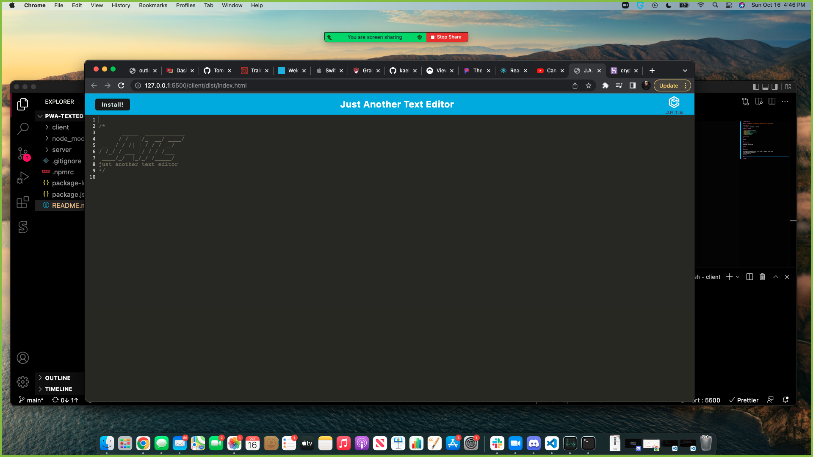

# PWA Text-Editor

## Description

A text editor to be used on or offline.

## Table of Contents

- [Installation](#installation)
- [Usage](#usage)
- [Contributions](#contributions)
- [Tests](#tests)
- [Questions](#questions)
- [License](#license)

## Installation

N/A

## Usage

## Contributions

2U bootcamp starter code.

## Tests

N/A

## Questions

For any Questions please contact me via GitHub or my Email listed below:
https://github.com/TommyBspeed
tommy.boileau@du.edu

## License

none

## Badges
